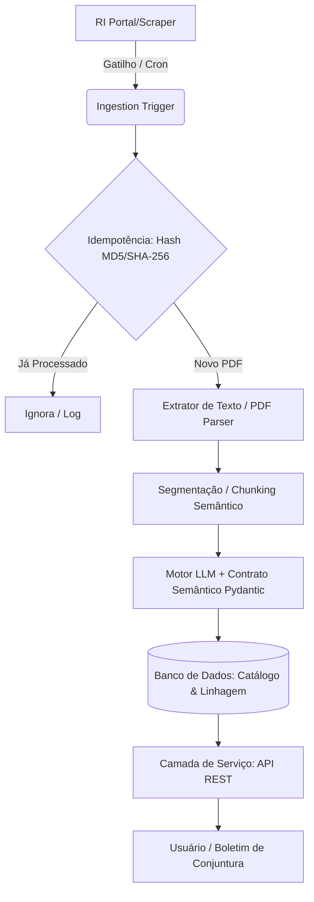

# Guia de Execução de IA: Pipeline de UDA (Unstructured Data Analysis)

Este documento define o fluxo de trabalho detalhado e passo a passo para que um agente de Inteligência Artificial implemente de forma autônoma e resiliente o **Pipeline de Engenharia e Análise de Dados Inteligente** para o setor corporativo habitacional, conforme especificado no [README.md](file://wsl$/Ubuntu/home/ubuntu/GCES/projeto4/Projeto-individual4-GCES/projeto-individual4-joaoguilherme/README.md).

---

## 🏗️ Arquitetura Geral do Pipeline

O diagrama abaixo ilustra o fluxo de dados desde a detecção do relatório até a disponibilização via API:



---

## 🛠️ Passo a Passo para Execução da IA

### Passo 1: Preparação do Ambiente e Modelagem de Dados
O objetivo deste passo é configurar as bases do projeto e definir como as tabelas do banco de dados e as estruturas de validação serão organizadas.

1. **Estrutura de Diretórios Recomendada**:
   ```text
   projeto-4/
   ├── app/
   │   ├── __init__.py
   │   ├── database.py      # Conexão, tabelas e Linhagem (Data Lineage)
   │   ├── models.py        # Modelos Pydantic (Contrato Semântico)
   │   ├── parser.py        # Ingestão de PDF, MD5 e Chunks
   │   ├── extractor.py     # Integração com LLM e Processamento
   │   ├── api.py           # Endpoints FastAPI
   │   └── scheduler.py     # Polling / Cron do Scraper
   ├── requirements.txt
   ├── README.md
   └── SKILL.md
   ```
2. **Definição de Dependências**:
   Gere um `requirements.txt` incluindo:
   - Framework de API: `fastapi`, `uvicorn`
   - Banco de Dados/ORM: `sqlalchemy`, `sqlite` (ou similar)
   - Parsing de PDF: `pypdf`, `pymupdf` (PyMuPDF) ou `pdfplumber`
   - LLM & Contratos: `openai` ou `google-generativeai` (conforme API de escolha), e `pydantic` (ou `instructor`)
   - Agendador: `apscheduler`
3. **Modelagem de Banco de Dados**:
   Crie tabelas com suporte a:
   - **Métricas Operacionais**: `empresa`, `ano`, `trimestre`, `vendas_brutas`, `vendas_liquidas`, `lancamentos`, `vso` (Venda sobre Oferta), etc. (use valores absolutos).
   - **Catálogo e Linhagem de Dados**: tabela contendo o `hash_pdf` (PK/Unique), `url_origem`, `nome_arquivo`, `data_processamento` e a chave estrangeira associando as métricas extraídas ao arquivo fonte.

---

### Passo 2: Gatilho de Ingestão e Idempotência (Idempotency Trigger)
Implemente o mecanismo de coleta de forma que o pipeline seja inteligente, auto-executável e evite processamento duplicado para controle de custos de API.

1. **Scraper / Polling (APScheduler)**:
   - Configure um worker que execute periodicamente (ex: simulando 1 vez ao dia) buscando links de PDFs no portal de RI das construtoras selecionadas (ex: MRV, Direcional, Tenda).
   - *Dica para Desenvolvimento*: Crie uma pasta local `app/downloads` ou um repositório mock de URLs para testar a captura contínua sem depender inteiramente de scrapers instáveis em tempo de teste.
2. **Verificação de Duplicidade (Idempotência)**:
   - Ao detectar um PDF ou URL, calcule o hash MD5 ou SHA-256 do arquivo.
   - Antes de iniciar o parsing e envio para a LLM, realize uma busca no banco de dados pelo hash computado.
   - **Fluxo de Decisão**:
     - Se o hash existir: Cancele a execução para o arquivo atual e gere um log informativo.
     - Se o hash NÃO existir: Prossiga com o download, salve as metadados na tabela de linhagem e envie o arquivo para o parser.

---

### Passo 3: Segmentação de Documentos (Chunking & Parsing)
Evite enviar PDFs gigantes de uma só vez para o LLM. Escolha e implemente a estratégia de tratamento de texto.

1. **Estratégia Recomendada: Chunking Semântico**:
   - Utilize bibliotecas de parsing (como `pdfplumber` ou `pymupdf`) para extrair o texto estruturado do PDF.
   - Implemente um filtro que escaneie os cabeçalhos de página e filtre apenas seções relevantes (como "Resultados Operacionais", "Vendas", "Lançamentos", "Tabela de Indicadores").
   - Segmente em blocos contextuais (ex: por páginas ou por seções delimitadas por títulos principais).
   - Caso o documento seja curto (menos de 5 páginas), você pode optar pela estratégia **Full-Scan**, mas a IA deve registrar a lógica de decisão adotada.

---

### Passo 4: Contrato Semântico & Extração via LLM
Esta é a camada central de inteligência. A extração deve ser blindada contra alucinações e variações de layout.

1. **Definição do Schema Pydantic (Contrato Semântico)**:
   ```python
   from pydantic import BaseModel, Field
   from typing import Optional

   class MetricasTrimestrais(BaseModel):
       empresa: str = Field(description="Nome padronizado da construtora (ex: MRV, Direcional, Tenda)")
       ano: int = Field(description="Ano fiscal com 4 dígitos")
       trimestre: int = Field(description="Número do trimestre correspondente (1, 2, 3 ou 4)")
       vendas_brutas_valor: Optional[float] = Field(None, description="Valor absoluto de Vendas Brutas (em Reais ou Unidades). Converter para valor bruto. Tratar ausências como None.")
       vendas_liquidas_valor: Optional[float] = Field(None, description="Valor absoluto de Vendas Líquidas. Tratar ausências como None.")
       lancamentos_valor: Optional[float] = Field(None, description="Valor absoluto de Lançamentos (VGV ou Unidades). Tratar ausências como None.")
       vso: Optional[float] = Field(None, description="Venda sobre Oferta (VSO) expressa como float (ex: 0.15 para 15%). Tratar ausências como None.")
   ```
2. **Prompts e Blindagem contra Alucinações**:
   No prompt do sistema fornecido ao LLM, instrua explicitamente:
   - **Extração de Valores Absolutos**: O LLM deve ignorar as porcentagens de crescimento comercial ressaltadas nos títulos das prévias (ex: "+25% em relação ao ano anterior") e focar unicamente nos valores absolutos da tabela ou do corpo do texto.
   - **Consistência Numérica**: Converter escalas explicitadas no documento (ex: "em milhões de R$" ou "milhares de unidades") para o número real absoluto (ex: multiplicar 15.4 milhões por 1.000.000).
   - **Valores Ausentes**: Se um indicador não for mencionado no PDF, o LLM deve preencher o campo correspondente com `None` (gerando `NULL` no banco), impedindo a invenção ou duplicação de dados de trimestres anteriores.
3. **Mapeamento de Saída Estruturada**:
   - Utilize a funcionalidade de chamada de função (*Function Calling* ou *Structured Output*) nativa do provedor de LLM para garantir que a resposta retorne estritamente um JSON aderente ao modelo Pydantic acima definido.

---

### Passo 5: Banco de Dados, Linhagem e Persistência
1. **Inserção Atômica**:
   - Se a validação semântica (Passo 4) for concluída com sucesso, salve o registro na tabela de métricas.
   - Salve simultaneamente na tabela de linhagem os dados do arquivo fonte (URL, Hash MD5, data de ingestão).
   - Faça o commit em uma única transação para evitar dados órfãos.

---

### Passo 6: Criação da Camada de Serviço (API REST)
Disponibilize os dados consolidados do banco através de uma API estruturada.

1. **Desenvolvimento dos Endpoints (FastAPI)**:
   - Criar o endpoint de consulta principal:
     `GET /api/conjuntura`
     - **Parâmetros de Filtro**: `empresa` (string, opcional), `ano` (int, opcional), `trimestre` (int, opcional).
     - **Resposta**: Retornar uma lista JSON das métricas extraídas contendo a linhagem do arquivo fonte associada para transparência de auditoria.
   - Criar endpoint de status / catálogo:
     `GET /api/catalogo`
     - **Resposta**: Retorna a lista de PDFs já processados (linhagem), seus hashes e datas de ingestão.

---

## 🧪 Estratégia de Testes e Validação do Pipeline

Para comprovar que o pipeline atinge os critérios de sucesso estabelecidos, a IA deve passar pelos seguintes cenários de validação:

### 1. Teste de Idempotência
1. Execute o pipeline enviando o arquivo `exemplo_Boletim_Conjuntura_2025_3T.pdf`.
2. Verifique se o registro foi salvo no banco.
3. Submeta o mesmo arquivo novamente.
4. O pipeline deve retornar uma mensagem avisando que o arquivo já foi computado (duplicidade evitada via hash) e nenhum registro extra deve ser criado ou custos adicionais gerados no LLM.

### 2. Teste de Variação de Layout (Resiliência)
O pipeline deve ser testado com pelo menos 2 arquivos de layouts completamente distintos:
- **Layout A (Boletim de Exemplo)**: Formato de boletim tradicional em PDF (ex: `exemplo_Boletim_Conjuntura_2025_3T.pdf`).
- **Layout B (Apresentação de Slides / Prévia Operacional)**: Colete uma prévia operacional recente da MRV ou Direcional em formato de apresentação/slides em PDF e submeta ao fluxo.
- **Resultado Esperado**: O pipeline deve conseguir processar ambos e inserir os dados corretamente nas mesmas colunas sem quebrar ou exigir alterações de código de parsing de layout físico.

### 3. Teste de Valores Absolutos vs. Percentuais
- Submeta um documento que possua chamadas de marketing destacadas em títulos (ex: *"Aumento de 45% nas Vendas Líquidas no 3T25"*).
- Verifique se o banco de dados armazena o valor absoluto correto (ex: `150.000.000.00`) ao invés do número `45.0` ou `0.45` no campo correspondente a vendas líquidas.

---

## 🎯 Lista de Verificação (Checklist) para a IA

A IA executora deve preencher e validar os seguintes itens ao finalizar o desenvolvimento:

- [x] **Modelagem e Infra**: Banco de dados relacional inicializado com campos adequados (incluindo tratamento de NULLs).
- [x] **Ingestão Inteligente**: Mecanismo de agendador (cron/polling) configurado para monitorar novas publicações de RI.
- [x] **Módulo de Idempotência**: Validação de hash do PDF funcional e testada.
- [x] **Camada de Parsing**: Implementação de parser robusto capaz de recuperar texto ou partes relevantes do documento.
- [x] **Prompt Blindado (Prompt Engineering)**: Instruções explícitas de valores absolutos, tratamento de escalas numéricas e negação de alucinação de dados ausentes.
- [x] **Contrato Semântico**: Uso de Pydantic/Instructor garantindo tipagem de saída segura e validação automatizada.
- [x] **Linhagem (Lineage)**: Registro inequívoco da fonte de dados associada a cada registro extraído.
- [x] **Servidor de API**: Endpoints RESTful funcionando com parâmetros de filtragem dinâmicos (`/api/conjuntura`).
- [x] **Resiliência Comprovada**: Execução bem-sucedida em layouts de PDFs estruturalmente diferentes.
